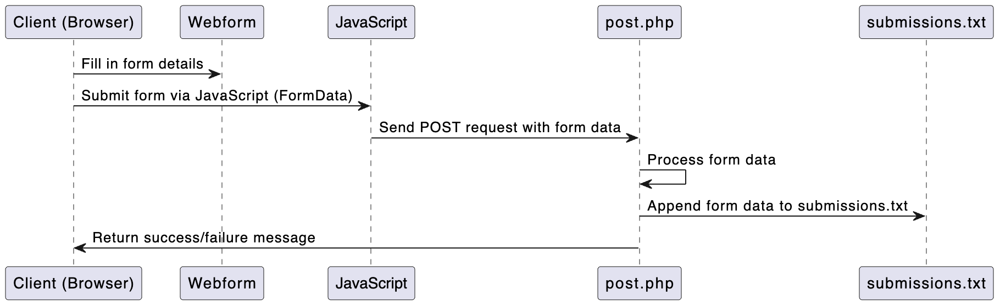

# Landing Page with ZohoCRM PHP Submission

This project is a simple landing page with PHP backend, which processes and appends form data to `submissions.txt` and will send data to Zoho CRM

## Workflow

1. User fills out the form in the browser.
2. Form data is submitted via JavaScript to `post.php`.
3. `post.php` processes the data and writes it to `submissions.txt` and sends it to `Zoho CRM`
4. A success or failure message is returned to the browser.

## Sequence Diagram

## Files

- `index.html`: The webform with JavaScript handling form submission.
- `post.php`: Receives form data and writes it to `submissions.txt`.
- `submissions.txt`: Stores the submitted form data.

## Usage

- Open `index.html` in the browser.
- Submit the form.
- Form data will be appended to `submissions.txt`.